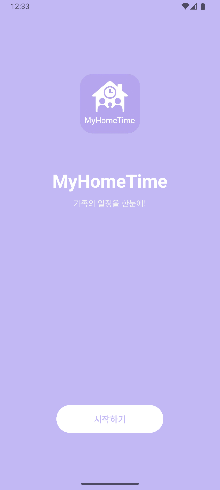

# MyHomeTime 🏠📅

가족 구성원이 서로의 일정을 한눈에 확인하고,  
급식과 로또 추첨 기능까지 함께 사용할 수 있는 안드로이드 앱입니다.

---

## 📱 주요 기능

- **시작 화면**
    - 앱 로고, 제목, 슬로건 및 시작 버튼

- **홈 화면**
    - 시간표, 급식 보기, 로또 추첨 메뉴 제공

- **시간표 화면**
    - 요일별 수업을 등록 및 확인 가능
    - 요일 필터링 기능 지원

- **급식 보기**
    - 오늘 날짜의 급식 정보를 표시
    - (현재는 샘플 데이터 기반)

- **로또 추첨**
    - 랜덤 번호 6개 + 보너스 번호 1개 추첨
    - 숫자별 색상 원형 스타일로 시각화
    - 
## 📲 실행 방법
1. Android Studio에서 `MyHomeTime` 프로젝트 열기
2. 에뮬레이터 또는 실제 기기로 실행
3. `Start` 버튼을 눌러 홈 화면으로 이동

---

## 🛠 개발 환경

- Android Studio (Empty Views Activity 기반)
- Kotlin / Java
- LinearLayout / GridLayout 사용
- Drawable XML로 커스텀 버튼 디자인

---

## 📌 향후 추가 예정 기능

- 급식 API 연동 (한국폴리텍대학 기준)
- 가족 구성원별 일정 공유 기능
- Firebase 연동 (로그인/DB 저장)

---

## ✨ 스크린샷

> 

https://www.figma.com/design/iCuOsSZdxQ0pcAmuLqgzm8/MyHomeTimeApp?node-id=0-1&p=f&t=8YYxxbuEcmymzCeG-0
---

## 📁 프로젝트 구조 (간략 예시)
```
MyHomeTime/
├── app/
│ ├── src/
│ │ ├── main/
│ │ │ ├── java/kr/ac/kopo/myhometime/
│ │ │ │ ├── MainActivity.java
│ │ │ │ ├── HomeActivity.java
│ │ │ │ ├── TimetableActivity.java
│ │ │ │ ├── MealActivity.java
│ │ │ │ └── LottoActivity.java
│ │ │ └── res/
│ │ │ ├── layout/
│ │ │ ├── drawable/
│ │ │ └── values/
├── README.md
```

---

## 🙋‍♀️ 개발자

- 차기환 | Korea Polytechnic University
- Major: Artificial Intelligence Software   
